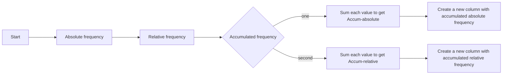

First PYE's signature homework, using Python I explore a dataset and analize it. In this notebook develop some useful functions to calculate central tendency's measures and scattering measures.

## Functions explained:
Functions development on the notebook were to get central tendency values and also get a dataframe with frequencies. These actions can be performed with `pandas` library but I decide to make it by myself.

### Get central measures
Function that returns a dataframe with these measures based on a qualitative variable.

### Get frequency table
Modify a dataframe to get absolute and relative frequencies and also accumulated values.

---

Enjoy ~🎍
